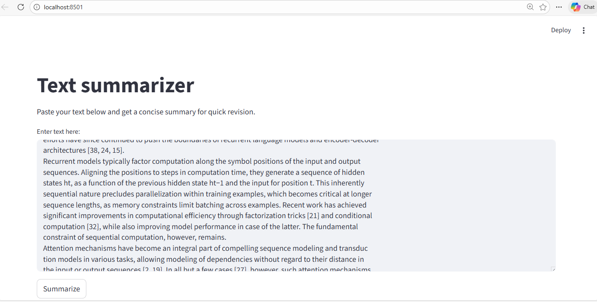
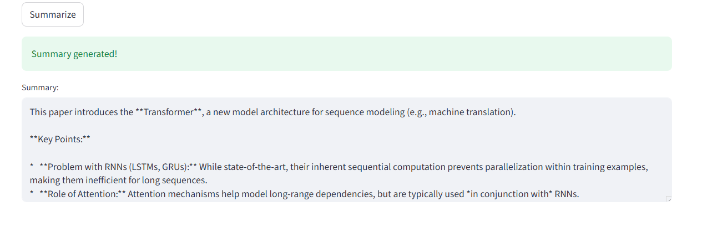

# LLM Text Summarizer using Gemini API

This project is a **lightweight Large Language Model (LLM) application** built using the **Google Gemini API**.  
It focuses on a simple but practical use case: **summarizing long text into concise notes for quick revision**.

The goal of this project is to understand how to:
- Use an LLM API correctly
- Design prompts for summarization
- Build a minimal UI using Streamlit
- Perform basic qualitative and semantic evaluation of LLM outputs

---

## 🚀 Features

- Text summarization using Gemini LLM
- Streamlit-based interactive UI
- Secure API key handling using `.env`
- Manual + semantic evaluation of generated outputs
- Beginner-friendly project structure (no RAG, no vector DB)

---

## 📂 Project Structure


```text
llm1/
├── streamlit_app.py        # Streamlit app for summarization
├── manual_evaluation.py    # Semantic similarity evaluation
├── config.py               # Loads Gemini API key
├── requirements.txt        # Project dependencies
├── .env                    # API key (not pushed to GitHub)
├── .gitignore              # Ignored files
└── README.md               # Project documentation
```


---

## 🧠 Problem Statement

Students and learners often struggle to revise **large chunks of text** efficiently.

Reading entire notes repeatedly is time-consuming and ineffective.

---

## ✅ Solution

This project uses a **Large Language Model (Gemini)** to:
- Accept long text input
- Generate concise summaries
- Help users quickly revise important concepts

---


# LLM Project Demo

### Streamlit App UI


### Model Results


# ⚙️ Setup Instructions

## 1. Clone the Repository
```bash
git clone https://github.com/your-username/LLM_Summarizer_Gemini.git
cd llm1

2. Create a Virtual Environment
python -m venv .venv

3. Activate the Virtual Environment

Windows (PowerShell):

Set-ExecutionPolicy -Scope CurrentUser -ExecutionPolicy RemoteSigned
.\.venv\Scripts\Activate.ps1


If PowerShell is restricted, use:

.\.venv\Scripts\activate.bat

4. Install Dependencies
pip install -r requirements.txt

5. Set Up Gemini API Key

Create a .env file in the project root:

GEMINI_API_KEY=your_api_key_here


⚠️ Do NOT push .env to GitHub.

▶️ Run the Streamlit App
streamlit run streamlit_app.py


Open the browser link shown in the terminal

Paste text into the input box

Click Summarize

View the generated summary

🧪 Manual & Semantic Evaluation

LLM outputs are evaluated using qualitative checks and semantic similarity.

What is evaluated:

Accuracy of the summary

Preservation of key ideas

Conciseness

Instruction-following behavior

Semantic Similarity Evaluation

from sentence_transformers import SentenceTransformer
from sklearn.metrics.pairwise import cosine_similarity

model = SentenceTransformer("sentence-transformers/all-mpnet-base-v2")

def semantic_score(reference, generated):
    ref_emb = model.encode([reference])
    gen_emb = model.encode([generated])
    return cosine_similarity(ref_emb, gen_emb)[0][0]


Provides a rough similarity score (0–1) between a reference summary and the LLM-generated output. Used as a supporting signal, not definitive.

📌 Key Learnings

Prompt clarity significantly affects output quality

LLMs can be useful even without retrieval or fine-tuning

Evaluation of LLMs is largely qualitative

Simple, focused projects are better than over-engineered ones

🔮 Future Improvements

Improve prompt design

Add batch evaluation

Add UI-based comparison of outputs

Explore different Gemini models

⚠️ This project is for learning/demo purposes only.

📣 Tech Stack

Python

Google Gemini API

Streamlit

Sentence Transformers

scikit-learn

📄 License

Open for educational use.


